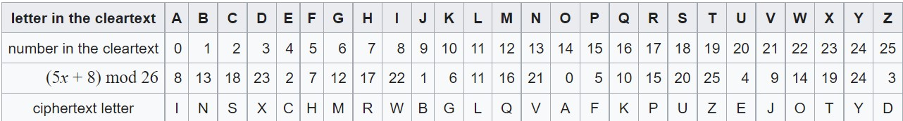

# Affine Cipher

Unencrypted text is generally called _plaintext_. Encrypted text is generally called _ciphertext_. And the secret used is called a _key_.

There are various methods for encrypting text, your task in this assignment will be to use an Affine cipher which is defined as follows:

Cipher Letter = (a * Plain Text Letter + b) mod m

<i>or more formally</i>

c<sub>i</sub> = (a * p<sub>i</sub> + b) mod m

Since we have 26 letters in the English alphabet, the m will always be 26, and it simply means "the remainder when dividing by 26".  You (the person enciphering the text) choose the value of the keys a and b.  For example, you could choose a = 5 and b = 8 and your formula for each letter would be:

c<sub>i</sub> = (5 * p<sub>i</sub> + 8) mod 26

Here's how that would look encrypting the entire English alphabet:



Notice how the original value of letters is assigned, we say A = 0, B = 1, C = 2 and so on.  You will need to keep this in mind when implementing your program, because by default the ASCII value for A = 65 and a = 97 🤔

Let's write a program called `affine` that enables you to encrypt messages using the Affine cipher. When the user executes the program you should first prompt them to input a positive integer value for `a` and an integer value for `b`.  If the user inputs 0 or a negative number, reject it and continue to prompt them for a number. Next the user should be prompted for the phrase they want to encrypt, which can include any combination of letters, numbers, punctuation and whitespace.

Here are a few examples of how the program might work. For example, if the user inputs `a` = 5, `b` = 8 and a plaintext of `HELLO`:

| plaintext    | H    | E    | L    | L    | O    |
| ------------ | ---- | ---- | ---- | ---- | ---- |
|   a = 5      |      |      |      |      |      |
|   b = 8      |      |      |      |      |      |
| = ciphertext | R    | C    | L    | L    | A    |

```
$ ./affine
a:5
b:8
plaintext:  HELLO
ciphertext: RCLLA
```

Here's how the program might work if the user provides a key of `a` = 9, `b` = 2  and a plaintext of `hello, world`:

```
$ ./affine
a:9
b:2
plaintext:  hello, world
ciphertext: nmxxy, syzxd
```

Notice that neither the comma nor the space were changed by the cipher. Only encrypt alphabetical characters!

How about one more? Here's how the program might work if the user provides a key of `a` = 7, `b` = 3, with a more complex plaintext:

```
$ ./affine
a:7
b:3
plaintext:  be sure to drink your Ovaltine
ciphertext: kf znsf gx yshqv pxns Xudcghqf
```

Notice that the case of the original message has been preserved. Lowercase letters remain lowercase, and uppercase letters remain uppercase.

## Specification
Design and implement a program, affine, that encrypts messages using the Affine cipher.

<ul>
   <li>Implement your program in a file called affine.c in a directory called affine.</li>
<li>You need to prompt the user to input an integer value for coefficient `a` (the multiplier) and an integer value for coefficient `b` (the addition shift), but you don’t need to worry if your program eventually breaks if the user chooses an integer value that’s too big or almost too big to fit in an int. (Recall that an int can overflow.)
<li>Your program must output plaintext: (without a newline) and then prompt the user for a string of plaintext (using get_string).</li>
<li>Your program must output ciphertext: (without a newline) followed by the plaintext’s corresponding ciphertext, with each alphabetical character changed to its encrypted value by way of the affine cipher formula; non-alphabetical characters should be outputted unchanged.</li>
<li>Your program must preserve case: capitalized letters, though changed, must remain capitalized letters; lowercase letters, though changed, must remain lowercase letters.</li>
<li>After outputting ciphertext, you should print a newline. Your program should then exit by returning 0 from main.</li>
 </ul>
How to begin? Let’s approach this problem one step at a time.

## Pseudocode

First, within the affine directory create a file `pseudocode.txt` and write some pseudocode that implements this program, even if not (yet!) sure how to write it in code. There's no one right way to write pseudocode, but short English sentences suffice.

There's more than one way to write pseudotext, so here's just one!

1. Prompt the user for a multiplier value `a`
2. Prompt the user for an addition shift value `b`
3. Prompt user for plaintext
5. Iterate over each character of the plaintext:
   1. If it is an uppercase letter, encrypt it using the affine cipher, preserving case, then print out the encrypted character
   2. If it is a lowercase letter, encrypt it using the affine cipher, preserving case, then print out the encrypted character
   3. If it is neither, print out the character as is
6. Print a newline

It's okay to edit your own after seeing this pseudocode here, but don't simply copy/paste this into your own!

## Your Turn

Things to keep in mind:

* Recall that ASCII maps all printable characters to numbers.
* Recall that the ASCII value of `A` is 65. The ASCII value of `a`, meanwhile, is 97.  We need 'A' and 'a' to be zero, 'B' and 'b' to be 1 etc. according to our affine formula.
* If you're not seeing any output at all when you call `printf`, odds are it's because you're printing characters outside of the valid ASCII range from 0 to 127. Try printing characters as numbers (using `%i` instead of `%c`) at first to see what values you're printing, and make sure you're only ever trying to print valid characters!

## Testing

### Correctness

```
check50 csbaxter/problems/2021/x/affine
```

### Style

```
style50 affine.c
```

## How to Submit

Execute the below, logging in with your GitHub username and password when prompted. For security, you'll see asterisks (`*`) instead of the actual characters in your password.

```
submit50 csbaxter/problems/2021/x/affine
```
